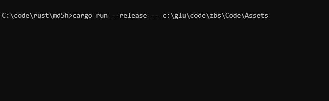

# MD5H
```
Calculates MD5 hash of folder and subfolders

USAGE:
md5h.exe [FLAGS] [OPTIONS] <folder>

FLAGS:
-h, --help       Prints help information
-q, --quiet      Quiet mode, only prints resulting MD5
-V, --version    Prints version information

OPTIONS:
-t, --threads <count>    Number of threads, by default equals to cpu count

ARGS:
<folder>    Folder to get MD5 from

Usage example: "md5h ."
```
